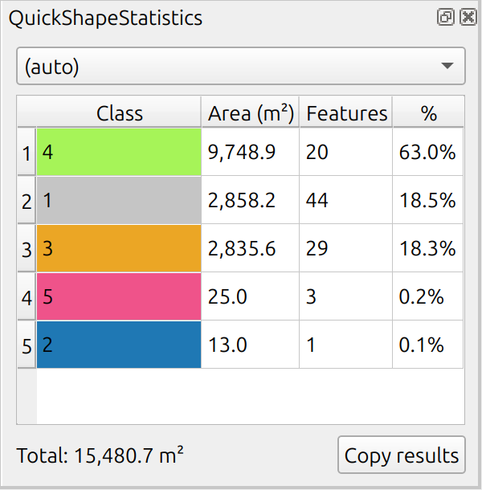

# QuickShapeStatistics

Draw a circle or polygon directly on the map and instantly see area,
length, or point-count statistics for the active layer within that
shape — broken down by class if the layer is categorized.

## Features

- **Draw Circle for statistics** — click to set the center, click again to
  set the radius. A live tooltip shows the current radius and area while
  dragging, or type a number and press Enter to set an exact radius.
  Right-click or Escape aborts.
- **Draw Polygon for statistics** — click to add vertices, finish with a
  double-click, right-click, or Enter. While drawing, a live tooltip shows
  the current segment's length and the polygon's area so far; type a
  number and press Enter to set an exact segment length. Escape cancels.
- Automatically measures area (polygon layers), length (line layers), or
  count (point layers), clipped precisely to the drawn shape
- Automatically groups results by class using the active layer's existing
  Categorized symbology; falls back to a sensible non-ID field if the layer
  isn't categorized, with a dropdown to override the field manually
- Feature count per class alongside the measured value
- Results table columns can be resized and sorted by clicking a column
  header, similar to a QGIS attribute table
- One-click copy of the results table (tab-separated, pastes directly
  into a spreadsheet, respects the current sort order)
- Warns and disables drawing (with a forbidden cursor) if the active layer
  isn't a vector layer
- Invalid drawn shapes are automatically repaired where possible; invalid
  features in the measured layer are skipped and reported rather than
  causing incorrect results

## Installation

**From the QGIS Plugin Repository** (show experimental plugins): Plugins > Manage
and Install Plugins > search "QuickShapeStatistics" > Install

**From a ZIP file**: Plugins > Manage and Install Plugins > Install from
ZIP > select the .zip > Install

## Requirements

QGIS 3.34 or later (tested on QGIS 3.34 LTR)

## Known limitation

Statistics are calculated on the main thread. On a very large active
layer or an unusually large drawn shape, QGIS may briefly become
unresponsive during calculation — it resolves on its own once the
calculation finishes. Not a crash, just a current trade-off.

## How measurements are calculated

Area and length are calculated geodesically — accounting for the earth's
curvature via QGIS's ellipsoid settings — rather than with flat planar
math. Results are always in square meters / meters, regardless of the
active layer's CRS. This relies on the project's Ellipsoid setting being
enabled, which is QGIS's default; if it's explicitly set to "None,"
the plugin silently falls back to flat calculations in the layer's
native units instead.

## Changelog

- **0.5** — Fixed thousands separator (space instead of comma); results
  table columns are now resizable and sortable by clicking headers;
  results panel reopens automatically when a shape is finished, if it
  was closed; live segment length and running area preview while
  drawing polygons, with typed segment length entry
- **0.4** — Documented ellipsoidal measurement behavior and units in the
  README
- **0.3** — Invalid geometry detection with automatic repair for drawn
  shapes, and invalid-feature skipping for the measured layer; live
  radius/area preview and typed-radius entry while drawing circles;
  right-click to abort a circle; cursor warning when the active layer
  isn't a vector layer; automatic fallback class field for uncategorized
  layers; adjusted results table column widths
- **0.2** — Removed unused scaffolding files flagged by the plugin
  repository scanner
- **0.1** — Initial release

## License

GPL v2 or later — see LICENSE.

## Acknowledgment

The creation of this plugin was prompted by Remo Probst, an independent
researcher from Austria who also works for Birdlife Austria.

This plugin was coded with the help of claude.ai.
